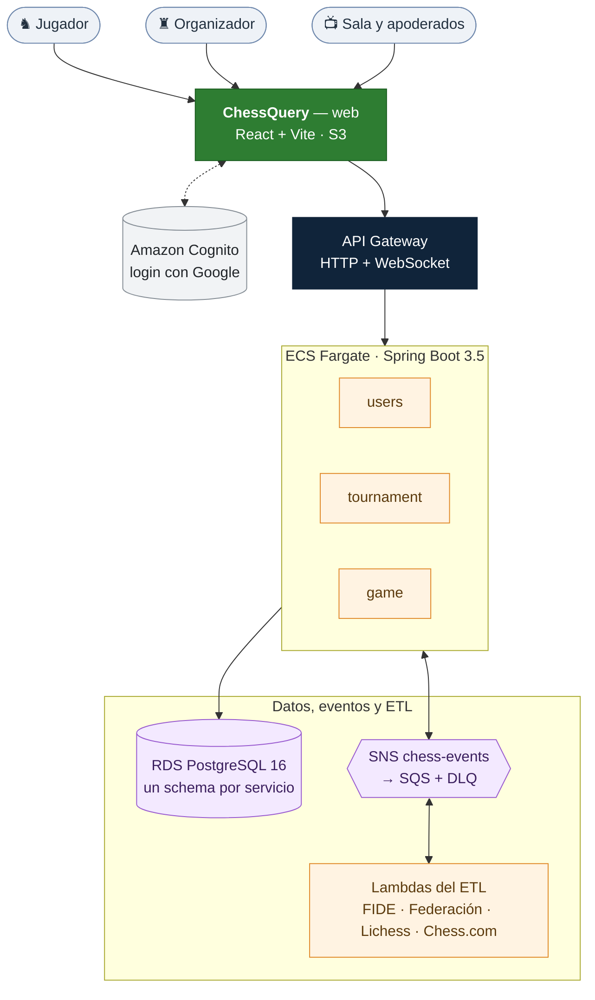

<div align="center">

# ♔ ChessQuery

### Juega, organiza y sigue el ajedrez chileno, en un solo lugar.

**Partidas en vivo con ELO por ritmo, torneos de club sin papel y tus ratings de la Federación, FIDE, Lichess y
Chess.com juntos: para quien recién empieza y para quien organiza.**

<p>
  
  
  
  
  
  
  <br>
  
  
  
  
</p>

</div>

<details>
<summary><sub>📑 Tabla de contenidos</sub></summary>

- [¿Qué es ChessQuery?](#-qué-es-chessquery)
- [¿Qué puedes hacer?](#-qué-puedes-hacer)
- [Estado del proyecto](#-estado-del-proyecto)
- [Para el equipo técnico](#-para-el-equipo-técnico)
  - [Arquitectura](#-arquitectura)
  - [Empezar en 5 minutos](#️-empezar-en-5-minutos)
  - [Qué hay en cada carpeta](#-qué-hay-en-cada-carpeta)
  - [APIs](#-apis)
  - [Comandos](#-comandos)
  - [Documentación clave](#-documentación-clave)
  - [Convenciones](#-convenciones)

</details>

---

## ♟ ¿Qué es ChessQuery?

En Chile, el ajedrez competitivo está repartido en muchos lugares:

- la ficha y el ELO nacional, en la Federación;
- el ELO internacional, en la FIDE;
- las partidas en línea, en Lichess o Chess.com;
- los torneos de club, en planillas, inscripciones por WhatsApp y resultados en papel.

**ChessQuery lo integra.** Entras con Google, eliges si vienes como **jugador** o como **organizador** y desde ahí
juegas, compites, organizas y sigues tu progreso. La sala, los apoderados y los profesores lo siguen en vivo.

---

## ✨ ¿Qué puedes hacer?

### ♞ Como jugador
- **Bienvenida en 3 pasos:** tu ritmo favorito, tus cuentas en otras plataformas y tu región.
- **Partidas 1 vs 1 en vivo** con reloj e incremento, y un **ELO ChessQuery por ritmo**: bala, relámpago, rápido y
  clásico.
- **Desafía a un amigo** desde su perfil, o a cualquiera con un **desafío abierto** por enlace o QR.
- **Un perfil con todos tus ratings:** vinculas tu ficha de la Federación, Lichess y Chess.com, y una Lambda los trae
  y los mantiene al día.
- **Ranking nacional**, búsqueda de jugadores, amigos, historial y PGN de tus partidas.

### ♜ Como organizador
- **Tu club y tu roster:** carga masiva por **CSV** e **invitación** para que cada jugador reclame su perfil.
- **Torneos de punta a punta:**
  - inscripción con cupo, aprobación y lista de espera;
  - **acreditación con QR**;
  - rondas solo con los presentes (ausentes y retiros incluidos), suizo o round robin;
  - cierre con ELO y **TRF** para homologar.
- **Desempates reales:** Buchholz, Buchholz corte 1, Sonneborn-Berger y victorias.

### 📺 Para la sala y los apoderados
- **Pantalla para el monitor** que rota entre la tabla y las mesas y se actualiza sola.
- **Seguir a un jugador** desde el celular, sin cuenta.

### 🏫 Para una clase en el colegio
- **Salas de juego** con código: el profesor asigna los tableros, ve hasta 4 por pantalla y los demás miran como
  espectadores. Esas partidas no cuentan para el ELO.

---

## 📌 Estado del proyecto

- ✅ **Desplegado en AWS** (Learner Lab), creado con Terraform:
  - API Gateway HTTP y WebSocket;
  - ECS Fargate;
  - RDS PostgreSQL;
  - SNS/SQS;
  - 5 Lambdas;
  - **login con Google por Amazon Cognito**.
- ✅ **Las cuatro historias de la demo** (jugador, organizador, sala en vivo y clase) verificadas en el navegador de
  punta a punta.
- ✅ **313 pruebas automatizadas:**
  - Java: 147, con cobertura ≥ 90 % por módulo;
  - ETL: 60;
  - web con axe: 85;
  - E2E con Playwright: 21, incluida una suite de **pruebas de abuso** (JWT, IDOR, XSS, inyección de fórmulas,
    WebSocket).
- ✅ **Privacidad por diseño (Ley 21.719):** a terceros nunca RUT, correo, fecha de nacimiento ni género, y los
  menores con el apellido abreviado.
- 🔜 Notificaciones por correo y la cuenta AWS propia (CloudFront y despliegue desde el CI).

---
---

# 🧑‍💻 Para el equipo técnico

## 🧩 Arquitectura

Tres servicios Spring Boot (un schema PostgreSQL por servicio) detrás de API Gateway y un ALB. Se comunican por un bus
**SNS → SQS** y el ETL corre en **Lambdas** que reciben de SNS directo. El diagrama completo, con los íconos de AWS,
está en [`docs/arquitectura/diagramas/01-arquitectura.svg`](./docs/arquitectura/diagramas/01-arquitectura.svg). Las
decisiones están en [`docs/adr/`](./docs/adr).



| Componente | Tipo | Puerto local | Stack |
|---|---|---|---|
| [`services/users`](./services/users) | servicio | 8081 | Spring Boot 3.5 · Java 21 |
| [`services/tournament`](./services/tournament) | servicio | 8082 | Spring Boot 3.5 · Java 21 |
| [`services/game`](./services/game) | servicio | 8083 | Spring Boot 3.5 · Java 21 |
| [`etl`](./etl) | Lambdas (y CLI local) | — | Python 3.12 |
| [`apps/web`](./apps/web) | SPA jugador + organizador | 5173 | React 18 + Vite |
| [`packages/ui-lib`](./packages/ui-lib) | design system | — | React 18 |
| [`infra/terraform`](./infra/terraform) | infraestructura como código | — | Terraform 1.10+ |

## ⚙️ Empezar en 5 minutos

Requisitos: **JDK 21, Maven 3.9, Docker, Node 20, Python 3.12** y [`uv`](https://docs.astral.sh/uv/). Terraform 1.10+
solo si tocas infraestructura.

```bash
npm install
make dev          # la app completa en http://localhost:5173 · Ctrl+C apaga todo
make demo-seed    # (en otra terminal) club, torneos, sala y cuentas listas para presentar
```

`make dev` levanta:

- Postgres y LocalStack (SNS/SQS/S3);
- un IdP simulado;
- los servicios `users`, `tournament` y `game`;
- el receptor SNS del ETL;
- la Federación, Lichess y Chess.com falsos (datos ficticios);
- la web.

Para entrar: **«Entrar con mi correo»**, cualquier usuario y los claims que imprime la consola. No necesita acceso a
AWS. Los logs quedan en `.logs/`.

## 🗂 Qué hay en cada carpeta

```
libs/common         errores REST, sobre de eventos ChessEvent, idempotencia, ELO y ritmos, lectura de payloads
libs/auth-starter   resource server OIDC, @CurrentUser, resolución sub → playerId, cliente interno hacia users
services/users      jugadores e identidad, bienvenida, ratings e historial, ranking, club y roster, amistades, privacidad
services/tournament torneos: inscripción con cupo, acreditación QR, suizo y round robin, cierre con ELO, TRF, sala en vivo
services/game       partidas 1 vs 1 con reloj, desafío abierto, salas de clase, ELO por ritmo; en vivo por WebSocket
etl                 FIDE, Federación, Lichess y Chess.com → S3 + eventos; Lambdas en la nube
apps/web            una sola app React con dos modos, jugador y organizador (+ E2E, seguridad y galería en apps/web/e2e)
packages/ui-lib     design system: tema oscuro con contraste AA, diálogos, avisos y tablas que se apilan en el celular
infra/terraform     IaC: envs/academy (Learner Lab) y módulos; envs/aws (cuenta propia) pendiente
infra/events        topología única del bus: qué cola o Lambda recibe qué evento (la leen LocalStack y Terraform)
scripts             stack local (dev, e2e), semilla de demo, humo de la nube y benchmark v2 vs v3
docs                arquitectura, ADR, eventos, login, ETL y verificación (índice en docs/README.md)
```

## 🔌 APIs

El ALB y el proxy de Vite enrutan por prefijo.

| Servicio | Prefijos | Qué hay |
|---|---|---|
| `users` :8081 | `/api/users/**` | yo (`/me`), perfil y bienvenida, historial de rating, exportar o borrar mis datos, ficha federativa, Lichess y Chess.com, búsqueda, ranking |
| | `/api/organizations/**` | crear mi club (= ser organizador), datos del club, roster, carga masiva, invitaciones |
| | `/api/friends/**`, `/api/catalog/**` | amistades; países y clubes federativos |
| | `/api/public/**` | sin login: ranking y perfil público (menores con apellido abreviado) |
| `tournament` :8082 | `/api/tournaments/**` | mis torneos, crear o editar, inscripción (cupo, aprobación, espera), acreditación, rondas, resultados, cerrar, TRF |
| | `/api/public/tournaments/**` | sin login: listado, detalle, sala en vivo (`/live?afterVersion=n`), tabla y calendario federado |
| `game` :8083 | `/api/games/**` | partidas, desafíos y desafío abierto (`/open`), jugar, abandonar, tablas; `?afterVersion=n` de respaldo |
| | `/api/rooms/**` | salas de clase: crear, entrar con código, asignar tableros, iniciar, cerrar |
| | `/api/public/games/**` | sin login: ver una partida y descargar su PGN |
| `users` | `/internal/**` | solo servicio→servicio con `X-Internal-Token` (nunca expuesto por API Gateway) |

Errores: `{ status, error, message, timestamp }`. Eventos entre servicios: [`docs/events.md`](./docs/events.md).

## 🧰 Comandos

| Comando | Qué hace |
|---|---|
| `make dev` | la app completa en local (ver arriba) |
| `make dev-idp` | lo mismo, con el login real con Google (Cognito del lab; [`docs/auth/cognito-google.md`](./docs/auth/cognito-google.md)) |
| `make demo-seed` | con `make dev` corriendo: club, torneos, sala y cuentas para presentar |
| `make test` | todas las pruebas: Java (`mvn clean verify`, cobertura ≥ 90 %), ETL (pytest) y web (Vitest + axe) |
| `make e2e` | recorridos de jugador y organizador, sesión, seguridad y galería de vistas (Playwright) |
| `make complexity` · `make tf-check` | complejidad ciclomática ≤ 10 por función · `terraform fmt` + `validate` |
| `make academy-*` | despliegue en el Learner Lab (lo ejecuta una persona; ver [`infra/terraform/README.md`](./infra/terraform/README.md)) |
| `make cloud-smoke` | pruebas de humo sin login contra lo desplegado |

## 📚 Documentación clave

> 📖 Índice completo en [`docs/README.md`](./docs/README.md).

| Documento | Contenido |
|---|---|
| [`docs/arquitectura/arquitectura-v3.md`](./docs/arquitectura/arquitectura-v3.md) (+ PDF) | Para las partes interesadas (problema, valor, guion de la demo), arquitectura en AWS, eventos, Terraform y ETL |
| [`docs/adr/`](./docs/adr) | Decisiones de arquitectura y despliegue, con sus enmiendas |
| [`docs/events.md`](./docs/events.md) | Catálogo de eventos: fuente de verdad |
| [`docs/verificacion/plan-de-pruebas.md`](./docs/verificacion/plan-de-pruebas.md) | Caja blanca y negra, seguridad, integración y tiempos de consulta |
| [`docs/verificacion/nube-aceptacion.md`](./docs/verificacion/nube-aceptacion.md) | Checklist de aceptación en la nube, rol por rol |
| [`CONTRIBUTING.md`](./CONTRIBUTING.md) · [`CLAUDE.md`](./CLAUDE.md) | Cómo trabajar en el repo |

## 📐 Convenciones

- Identidad siempre desde `@CurrentUser UserPrincipal`, nunca del body ni de la URL.
- Datos personales (Ley 21.719): a terceros nunca RUT, correo, fecha de nacimiento ni género; menores abreviados.
- Un schema PostgreSQL por servicio, sin FKs entre schemas; Flyway es dueño del esquema.
- Eventos: sobre `ChessEvent` en el tópico SNS `chess-events`, una cola SQS por consumidor; todo evento nuevo se
  documenta primero en `docs/events.md`.
- Ramas: se trabaja en `develop` y ramas de feature, todo por PR con CI verde; `main` recibe solo desde `develop`.
