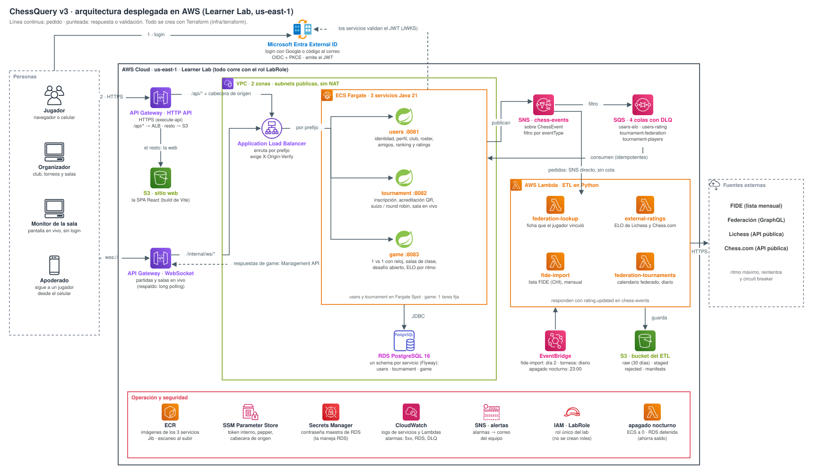
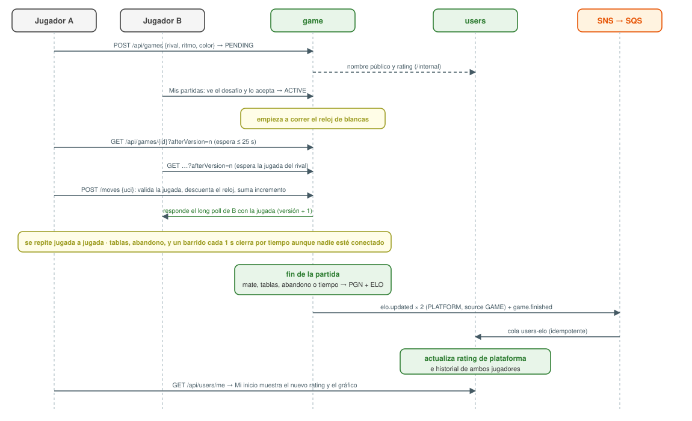
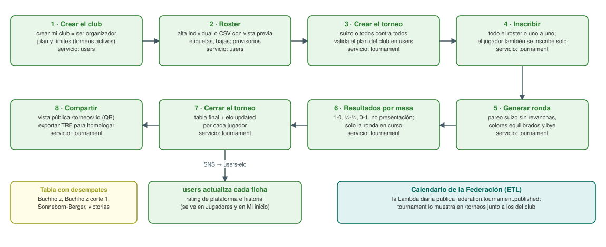
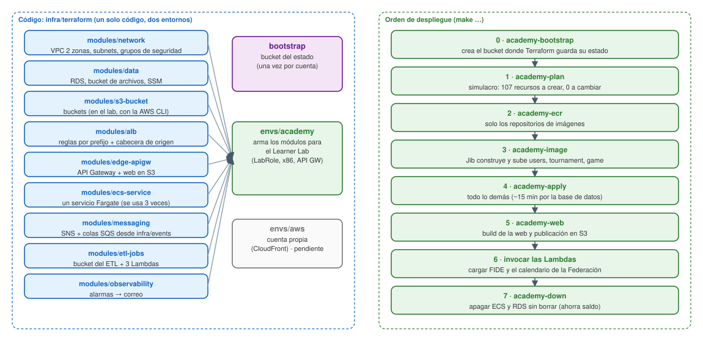
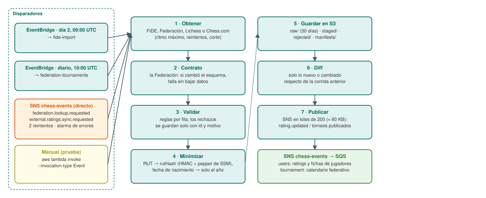

# Arquitectura de ChessQuery v3

Documento vigente al 30-09-2026. Fuente única en Markdown (lo leen personas y agentes); el PDF se genera con
`make arquitectura-docs`. Las decisiones y su porqué están en `docs/adr/` (0001 arquitectura, 0002 despliegue).

**Prioridad actual:** que funcionen de punta a punta los dos recorridos del producto:

1. **Jugador:** entra con Google o su correo, arma su perfil, agrega amigos y **juega partidas 1 vs 1 en vivo**; al
   terminar, su rating de plataforma y su historial se actualizan solos.
2. **Organizador:** crea su **club**, carga a sus **jugadores** (roster), **organiza torneos** (inscripción, rondas,
   resultados, tabla, cierre) y exporta el TRF; los ratings e información de sus jugadores se actualizan al cerrar.

El ETL (ratings FIDE y datos de la Federación) alimenta esos recorridos con datos reales, pero no los bloquea.

## 1. Vista general



| Pieza | Qué hace | Dónde vive |
|---|---|---|
| **Entra External ID** | Registro e inicio de sesión (Google o código al correo). La app **nunca** ve ni guarda contraseñas: recibe un token firmado y lo valida. | Tenant externo de Microsoft |
| **API Gateway (HTTP API)** | Única entrada HTTPS. `/api/*` va al ALB; todo lo demás, a la web en S3. Un solo origen: sin CORS. | AWS |
| **ALB** | Reparte cada ruta al servicio que corresponde y rechaza lo que no trae la cabecera secreta que agrega API Gateway. | AWS |
| **users** (:8081) | Identidad interna, perfil, club y roster, amigos, ranking, ratings e historial, ficha federativa, privacidad. | ECS Fargate |
| **tournament** (:8082) | Torneos del club: inscripción, pareo suizo y round robin, resultados, desempates, cierre con rating, TRF, vista pública, calendario federativo. | ECS Fargate |
| **game** (:8083) | Partidas 1 vs 1: desafíos, jugadas y reloj en el servidor, fin por mate/tablas/abandono/tiempo, PGN, ELO. | ECS Fargate |
| **RDS PostgreSQL 16** | Una instancia, un schema por servicio; sin claves foráneas entre schemas. | AWS |
| **SNS + SQS** | Bus de eventos: un tópico y una cola por consumidor, con DLQ y alarma. | AWS |
| **Lambdas del ETL** | FIDE mensual, torneos de la Federación diarios y la ficha que pide cada jugador. | AWS Lambda |
| **SSM Parameter Store** | Token interno entre servicios, pepper del hash del RUT, cabecera de origen. Nunca en el código. | AWS |
| **CloudWatch** | Logs de todo y alarmas (5xx, servicio caído, disco de RDS, mensajes en DLQ) a un correo. | AWS |

**Llamadas entre servicios:** `tournament` y `game` le piden a `users` nombres y ratings por `/internal/*`, con un
token interno. En el Learner Lab no hay Cloud Map, así que esa llamada pasa por el ALB (con la cabecera de origen);
API Gateway no publica `/internal`, así que no es alcanzable desde internet.

## 2. Partida 1 vs 1 (prioridad)



- **Desafío:** desde el perfil de un jugador o desde Amigos → ritmo (3+2, 5+0, 10+0, 15+10, 30+0) y color. El rival
  lo ve en *Mis partidas* y acepta o rechaza; sin respuesta, vence a los 10 minutos.
- **En vivo por long polling:** cada navegador pregunta `GET /api/games/{id}?afterVersion=n` y el servidor responde
  apenas hay una jugada nueva (o a los 25 s sin cambios). Funciona a través de API Gateway, que no transporta
  WebSocket. Enmienda del ADR-0002 del 29-09-2026.
- **El servidor manda:** valida cada jugada (librería `chessgame`), lleva el reloj y un barrido cada segundo cierra
  por tiempo aunque nadie esté conectado. El tablero del navegador solo muestra.
- **Qué datos se actualizan al terminar:** `game` guarda el resultado y el PGN (descargable) y publica `elo.updated`
  para ambos jugadores; `users` actualiza el **rating de plataforma** y el **historial** (gráfico de *Mi inicio*).
  El ELO usa K = 40 para quien aún no tiene rating de plataforma, 20 bajo 2400 y 10 desde 2400.

## 3. Organizador: club, jugadores y torneos (prioridad)



- **Club y jugadores (users):** crear el club convierte al jugador en organizador. El roster admite alta individual
  o **CSV** con vista previa (ok / duplicado / error), etiquetas y bajas. Los jugadores sin cuenta quedan como
  *provisorios*; si después se registran con el mismo correo verificado, la ficha pasa a ser suya.
- **Torneos (tournament):** suizo (pareo sin revanchas, colores equilibrados, bye al de menos puntos sin bye previo)
  o todos contra todos (tablas de Berger). Resultados por mesa en la ronda en curso; tabla con Buchholz, Buchholz
  corte 1, Sonneborn-Berger y victorias.
- **Cierre:** fija la tabla y, si el torneo es válido para rating, publica `elo.updated` por jugador; `users`
  actualiza la ficha de cada uno (se ve en *Jugadores* y en *Mi inicio*). **TRF-16** para homologar y **vista
  pública** `/torneos/:id` para la sala.
- **Información de jugadores a terceros (Ley 21.719):** nunca RUT, correo, fecha de nacimiento ni género; los menores
  aparecen con el apellido abreviado. El TRF, que lo descarga solo el organizador, sí lleva el nombre completo.

## 4. Eventos entre servicios

Fuente de verdad: `docs/events.md`. Topología (qué cola recibe qué): `infra/events/topology.json`, que leen
LocalStack (local) y Terraform (nube).

| Cola SQS | Evento | Productor → consumidor |
|---|---|---|
| `users-elo` | `elo.updated` | game y tournament → users (rating de plataforma e historial) |
| `users-rating` | `rating.updated` | ETL → users (ratings FIDE y de la Federación) |
| `tournament-federation` | `federation.tournament.published` | ETL → tournament (calendario federativo) |
| `tournament-players` | `player.merged` | users → tournament (un jugador reclamó una ficha federada) |

Cada cola tiene su DLQ (tras 5 intentos) con alarma; los consumidores son idempotentes (un mensaje repetido no
duplica nada). Las Lambdas del ETL no usan cola: SNS les entrega el evento directo (`federation.lookup.requested` →
`federation-lookup`, cuando el jugador vincula su ficha), Lambda reintenta 2 veces y una alarma avisa si falla.

## 5. Terraform: la infraestructura como código



**Qué es:** Terraform describe toda la infraestructura en archivos (`infra/terraform/`). Con `plan` muestra qué
crearía o cambiaría sin tocar nada; con `apply` lo crea; con `destroy` lo borra entero. Guarda su "memoria" (el
estado) en un bucket S3 propio, versionado y cifrado.

**Un solo código, dos entornos:** los módulos (`modules/*`) son piezas reutilizables; `envs/academy` los arma para el
Learner Lab y `envs/aws` (pendiente) para una cuenta propia con CloudFront.

**Despliegue en el Learner Lab, paso a paso** (credenciales del lab en el perfil `default`):

```bash
make academy-bootstrap   # 0. una vez por cuenta: bucket del estado de Terraform
make academy-plan        # 1. simulacro: debe decir solo "to add" (107 recursos la primera vez)
make academy-ecr         # 2. solo los repositorios de imágenes
make academy-image       # 3. Jib construye y sube users, tournament y game (x86) con el tag del commit
make academy-apply       # 4. todo lo demás (~15 min, casi todo por RDS)
make academy-web         # 5. build de la web (con los datos de Entra) y publicación en S3; imprime la URL
                         # 6. cargar datos: invocar las Lambdas del ETL (ver sección 6)
make academy-down        # 7. al terminar el día: ECS en 0 y RDS detenida, sin borrar nada
```

**Por qué las imágenes van antes del `apply` completo:** los servicios ECS tienen rollback automático; si se crean
sin imagen en ECR, el primer despliegue queda fallido. Todos los pasos usan el mismo tag (el commit actual).

**Restricciones del Learner Lab y cómo se resolvieron:**

| Restricción (verificada) | Solución |
|---|---|
| No se pueden crear roles IAM | Todo usa el rol existente `LabRole` |
| CloudFront, AppSync y Cloud Map bloqueados | API Gateway como entrada HTTPS; long polling para el tiempo real; `/internal` por el ALB |
| El lab niega leer la configuración de *object lock* de los buckets (el recurso `aws_s3_bucket` la lee siempre y falla) | Módulo `s3-bucket`: en el lab crea el bucket con la AWS CLI; cifrado, acceso público, sitio web y ciclo de vida siguen en Terraform |
| EventBridge Scheduler necesita un rol propio | Reglas de EventBridge (no requieren rol) |
| Fargate ARM no verificado | Imágenes x86 |
| Credenciales que vencen cada ~4 h | Volver a copiarlas al perfil `default` antes de cada sesión |

**Estado verificado el 30-09-2026:** 107 recursos creados sin errores; los 3 servicios sanos en el ALB; rutas
públicas 200; `/api/users/me` sin sesión 401; el ALB directo sin la cabecera 404; `/internal` desde internet 404.

## 6. ETL con AWS Lambda, paso a paso



**Las tres Lambdas** (módulo `modules/etl-jobs`, Python 3.12, sin dependencias: `boto3` viene en el runtime):

| Lambda | Disparador | Qué hace | Límites |
|---|---|---|---|
| `fide-import` | EventBridge, día 2 de cada mes 09:00 UTC | Lista FIDE (CHI) → `rating.updated` | 900 s · 1024 MB |
| `federation-tournaments` | EventBridge, todos los días 10:00 UTC | Torneos de la Federación → `federation.tournament.published` | 300 s · 256 MB |
| `federation-lookup` | SNS directo: `federation.lookup.requested` (sin cola, 2 reintentos) | La ficha que pidió un jugador → `rating.updated` | 60 s · 256 MB |

**Cómo se implementa, paso a paso:**

1. **Empaquetado:** Terraform arma un zip con la carpeta `chessquery_etl/` completa (solo los `.py`) y lo sube a
   cada Lambda; si el código cambia, el `apply` actualiza las tres. Handlers: `chessquery_etl.handler.lambda_handler`
   (FIDE) y `chessquery_etl.federation.cli.lambda_handler` (Federación; distingue el modo por el evento).
2. **Configuración:** variables `ETL_BUCKET`, `CHESS_EVENTS_TOPIC_ARN` y `PRIVACY_PEPPER_PARAM` (el nombre del
   parámetro en SSM; el pepper se lee en tiempo de ejecución y nunca queda en texto plano). La descarga masiva de
   jugadores de la Federación queda apagada (`FEDERATION_BULK_PLAYERS_ENABLED=false`) hasta que exista un convenio.
3. **Dentro de cada corrida:** obtener → (Federación) verificar el contrato del esquema → validar fila por fila →
   minimizar (RUT → `rutHash`, fecha → año) → guardar en S3 → diff contra la corrida anterior → publicar en SNS en
   lotes de 200 → manifest con leídos, aceptados, rechazados y publicados.
4. **Errores:** si se rechaza más del 5 % de las filas, la corrida no publica nada. En la consulta puntual, un pedido
   que falla vuelve a la cola (`batchItemFailures`) y tras 5 intentos pasa a la DLQ con alarma.
5. **Invocar a mano (prueba)** y **verificar**: `GET /api/public/tournaments/calendar` (calendario) y
   `GET /api/public/ranking?type=FIDE_STANDARD` (ranking FIDE).

```bash
aws lambda invoke --function-name chessquery-academy-federation-tournaments --invocation-type Event \
  --cli-binary-format raw-in-base64-out --payload '{"mode":"tournaments"}' /dev/null
aws logs tail /aws/lambda/chessquery-academy-federation-tournaments --since 10m
```

**Hallazgo del 30-09-2026 — FIDE no acepta conexiones desde AWS:** la Lambda `fide-import` no logra abrir la conexión
con `ratings.fide.com` (tiempo de espera agotado), mientras que desde un computador la descarga tarda menos de 1 s.
No es un error del código. Mientras tanto, la importación se corre desde fuera de AWS publicando en la nube (mismo
resultado que la Lambda):

```bash
AWS_PROFILE=default etl/.venv/bin/python -m chessquery_etl.handler \
  --bucket <bucket del ETL> --topic-arn <ARN del tópico chess-events>
```

Resultado de esa carga: 9.271 jugadores leídos, 4.192 con rating FIDE, 21 lotes; el ranking FIDE público quedó con
datos reales. Alternativas para automatizarlo: subir la lista a `raw/` del bucket desde fuera de AWS (y que la
Lambda la lea de S3), o correr la importación mensual en el CI.

## 7. Qué está verificado y qué falta

| Qué | Estado |
|---|---|
| Recorrido completo del jugador (perfil, ficha federativa, amistad, desafío, partida 1 vs 1 hasta el mate, rating e historial) | ✅ en el navegador (Playwright) contra el stack local |
| Recorrido completo del organizador (club, roster por CSV, etiquetas, torneo suizo de 3 rondas, cierre, ficha del jugador actualizada, TRF, vista pública) | ✅ en el navegador contra el stack local |
| Despliegue en AWS (Learner Lab) | ✅ 107 recursos, servicios sanos, seguridad de la entrada verificada |
| Datos reales en la nube | ✅ calendario de la Federación (Lambda) y ranking FIDE (importación desde fuera de AWS) |
| Login real con Google en la nube | ⏳ falta el tenant de Entra External ID; luego se publica la web y se prueban los dos recorridos con cuentas reales |
| `services/notifications` | ⏳ pendiente |
