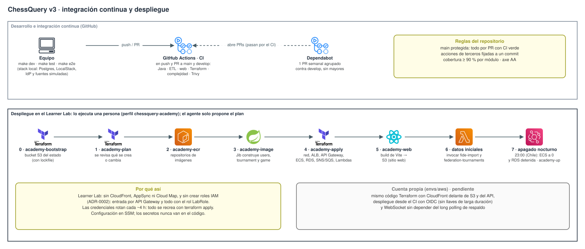

# Arquitectura de ChessQuery v3

Documento vigente al 08-10-2026. Es la fuente única en Markdown, la leen personas y agentes; el PDF se genera con
`make arquitectura-docs`. Las decisiones y su porqué están en `docs/adr/`: 0001 arquitectura y 0002 despliegue, con
sus enmiendas.

## 0. Para las partes interesadas

**El problema.** El ajedrez competitivo en Chile está repartido en varios lugares:

- la ficha y el ELO nacional están en la Federación;
- el ELO internacional está en la FIDE;
- las partidas en línea están en Lichess o Chess.com;
- los torneos de club se llevan en planillas, con inscripciones por WhatsApp y resultados en papel.

Quien recién empieza no sabe por dónde entrar. El organizador de un club o de un colegio hace a mano lo que podría
ser automático.

**La propuesta de valor.** ChessQuery es la plataforma que **integra** todo eso:

- Un jugador entra con Google y juega partidas con reloj. Cada ritmo (bala, relámpago, rápido y clásico) tiene su
  propio ELO ChessQuery.
- En un solo perfil ve sus ratings de la Federación, la FIDE, Lichess y Chess.com.
- Un organizador lleva su torneo de punta a punta desde el celular: inscripción, acreditación con QR, rondas,
  resultados, cierre con ELO y TRF para homologar.
- La sala, los apoderados y los profesores siguen todo en vivo.

**Guion de la demo (cuatro historias).** Con `make dev` y luego `make demo-seed`, que crea el club, los torneos, la
sala y las cuentas, e imprime cómo entrar y qué URL abrir.

| # | Historia | Qué se muestra |
|---|---|---|
| 1 | **«Soy nuevo y quiero jugar»** | Valentina entra y el **asistente de bienvenida** (3 pasos) le pide su ritmo favorito, sus cuentas en otras plataformas y su región. Desafía a un amigo o escanea el QR de un **desafío abierto** y juega con reloj; al terminar sube su ELO de ese ritmo. Tomás muestra el perfil que **une la Federación, la FIDE, Lichess y Chess.com**. |
| 2 | **El organizador** | Profe Demo carga el roster por **CSV**, abre el *Abierto Demo* con cupo y aprobación, **acredita con QR**, genera rondas solo con los presentes (ausentes y retiros incluidos), cierra con ELO y exporta el **TRF**. Invita a un alumno del roster a **reclamar su perfil** con un enlace. |
| 3 | **La sala en vivo** | La **pantalla del monitor** de la *Liga Demo* rota entre la tabla y las mesas y se actualiza sola. Un apoderado **sigue a su hijo** desde el celular, sin cuenta. |
| 4 | **Clase en el colegio** | **Sala de juego** «Clase 4°B»: los alumnos entran con un código, la profesora asigna los tableros y ve hasta 4 por pantalla. Los demás miran como espectadores. Esas partidas no cuentan para el ELO. |

**Prioridades:**

- **Ahora:** las cuatro historias de punta a punta, verificadas en el navegador.
- **Después:**
  - árbitro delegado;
  - corrección de resultados de rondas anteriores;
  - auto-acreditación con QR rotativo.
- **Fuera de alcance:**
  - pagos de inscripción;
  - ligas por equipos;
  - análisis con motor;
  - verificación OAuth de las cuentas de Lichess y Chess.com.

**Plan B.** Si el lab o la red fallan durante la presentación, la demo corre completa en local (`make dev` +
`make demo-seed`). Además, se graba antes un video del recorrido.

## 1. Vista general


| Pieza | Qué hace | Dónde vive |
|---|---|---|
| **Amazon Cognito + Google** | Registro e inicio de sesión **con Google** (user pool en el plan Lite, módulo `auth-cognito`). La app **nunca** ve ni guarda contraseñas: recibe el ID token firmado y lo valida con las llaves públicas del pool. Entra External ID queda como opción para la cuenta propia (ADR-0002, enmienda 09-10). | AWS |
| **API Gateway (HTTP API)** | Única entrada HTTPS. `/api/*` va al ALB con una cabecera secreta; todo lo demás va a la web en S3. Un solo origen, sin CORS. | AWS |
| **API Gateway (WebSocket)** | Partidas y salas en vivo: reenvía conexiones y mensajes a game (`/internal/ws/*`), y game responde por la Management API. Si el WebSocket no conecta, la web sigue por long polling. | AWS |
| **ALB** | Reparte cada ruta al servicio que corresponde y rechaza lo que no trae la cabecera de origen. | AWS (VPC) |
| **users** (:8081) | Identidad interna, perfil y bienvenida, club y roster (CSV e invitación para reclamar el perfil), amigos, ranking, ratings por ritmo e historial, ficha federativa, cuentas de Lichess y Chess.com, privacidad. | ECS Fargate |
| **tournament** (:8082) | Torneos: inscripción con cupo, aprobación y lista de espera, acreditación con QR, pareo suizo y round robin con ausentes y retiros, resultados, desempates, cierre con ELO del ritmo, TRF, vista pública, sala en vivo y calendario federativo. | ECS Fargate |
| **game** (:8083) | Partidas 1 vs 1 con reloj en el servidor, desafíos y desafío abierto por enlace o QR, salas de juego para clases (N tableros, código, sin ELO), PGN y ELO por ritmo. | ECS Fargate |
| **RDS PostgreSQL 16** | Una instancia con un schema por servicio y sin claves foráneas entre schemas. Flyway es dueño del esquema. | AWS (VPC) |
| **SNS + SQS** | Bus de eventos: un tópico (`chess-events`) y una cola por consumidor Java, con DLQ y alarma. | AWS |
| **Lambdas del ETL** | FIDE mensual, torneos de la Federación diarios, la ficha que pide cada jugador y los ratings de Lichess y Chess.com. | AWS Lambda |
| **SSM Parameter Store · Secrets Manager** | Token interno, pepper del hash del RUT y cabecera de origen (SSM). La contraseña maestra de RDS (Secrets Manager, la maneja RDS). Nada en el código. | AWS |
| **ECR** | Imágenes de los tres servicios (Jib), inmutables, con escaneo al subir. | AWS |
| **CloudWatch** | Logs de todo y alarmas (5xx, servicio caído, disco de RDS, mensajes en DLQ, errores de Lambda) que llegan a un correo por SNS. | AWS |
| **Apagado nocturno** | Regla de EventBridge y una Lambda que a las 23:00 (Chile) dejan ECS en 0 y detienen RDS si nadie corrió `make academy-down`. | AWS |

**Llamadas entre servicios.** `tournament` y `game` le piden a `users` nombres y ratings por `/internal/*`, con un
token interno.

- En el Learner Lab no hay Cloud Map, así que esa llamada pasa por el ALB, con la cabecera de origen.
- API Gateway no publica `/internal`, así que no se puede alcanzar desde internet.

## 2. Jugar: partida 1 vs 1, desafío abierto y ELO por ritmo


- **Desafío.** Se lanza desde el perfil de otro jugador, desde Amigos o con un **desafío abierto**: un enlace o QR
  que acepta cualquiera con cuenta. El ritmo se elige entre presets o uno personalizado; por defecto, el ritmo
  favorito de la bienvenida.
- **Ritmo y ELO.** El ritmo define qué ELO ChessQuery se juega. La duración estimada es base + 40 × incremento:
  menos de 3 min es bala, menos de 8 es relámpago, menos de 25 es rápida, y desde 25 es clásica.
- **En vivo.**
  - Lo normal es el WebSocket: API Gateway en la nube, `/ws` en local.
  - De respaldo, long polling: `GET /api/games/{id}?afterVersion=n`, que responde apenas hay una jugada o a los
    25 s sin cambios.
  - El servidor valida cada jugada y lleva el reloj. Un barrido cada segundo cierra por tiempo aunque nadie esté
    conectado.
- **Al terminar.** `game` guarda el resultado y el PGN y publica `elo.updated` con el ritmo. `users` actualiza el ELO
  de ese ritmo y el historial. El factor K es 40 en los primeros juegos (provisional), 20 bajo 2400 y 10 desde 2400.
- **Salas de juego (clases).** Cada tablero es una partida normal sin ELO. La vista del organizador muestra hasta
  4 tableros por pantalla y se actualiza por suscripción a la sala.

## 3. Organizar: club, jugadores y torneos


- **Club y roster (users).** Crear el club convierte al jugador en organizador.
  - El roster admite alta individual o **carga masiva por CSV**. El servidor informa fila por fila: creado,
    duplicado o error.
  - Cada jugador del roster recibe una **invitación** (enlace o QR, 30 días) para reclamar su perfil con su propia
    cuenta.
- **Inscripción y acreditación (tournament).**
  - El torneo puede tener cupo, cierre, rango de rating, aprobación por el organizador y lista de espera.
  - Si exige acreditación, cada inscrito tiene su **QR**: el organizador lo escanea con la cámara o imprime las
    credenciales.
  - Las rondas se arman solo con los presentes. Los ausentes y retirados no se emparejan; en round robin, pierden
    por no presentación.
- **Rondas y cierre.**
  - Suizo: sin revanchas, colores equilibrados y bye al de menos puntos. Todos contra todos: tablas de Berger.
  - Desempates: Buchholz, Buchholz corte 1, Sonneborn-Berger y victorias.
  - Al cerrar se publica `elo.updated` con el ritmo del torneo.
  - El **TRF-16** sale con los textos neutralizados contra fórmulas e inyección de líneas.
- **Sala en vivo.** La vista pública `/torneos/:id` y la **pantalla del monitor** `/torneos/:id/pantalla` (rota cada
  15 s, mantiene la pantalla encendida y muestra un QR) se actualizan por long polling según la versión del torneo.
  Un apoderado **sigue a un jugador** sin cuenta.
- **Datos personales (Ley 21.719).** A terceros nunca se entrega el RUT, el correo, la fecha de nacimiento ni el
  género; los menores aparecen con el apellido abreviado. El TRF, que descarga solo el organizador, sí lleva el
  nombre completo.

## 4. Eventos entre servicios

Fuente de verdad: `docs/events.md`. La topología (qué cola o Lambda recibe qué) está en
`infra/events/topology.json`. La leen LocalStack y el receptor SNS local en desarrollo, y Terraform en la nube.

| Destino | Evento | Productor → consumidor |
|---|---|---|
| cola `users-elo` | `elo.updated` | game y tournament → users (ELO por ritmo e historial) |
| cola `users-rating` | `rating.updated` | ETL → users (FIDE, Federación, Lichess y Chess.com) |
| cola `tournament-federation` | `federation.tournament.published` | ETL → tournament (calendario federativo) |
| cola `tournament-players` | `player.merged` | users → tournament (un perfil reclamado o unido) |
| Lambda `federation-lookup` | `federation.lookup.requested` | users → ETL (el jugador vinculó su ficha) |
| Lambda `external-ratings` | `external.ratings.sync.requested` | users → ETL (al vincular Lichess o Chess.com, al sincronizar y una vez al día) |

**Garantías:**

- Cada cola tiene su DLQ (tras 5 intentos) con alarma.
- Los consumidores son idempotentes: un mensaje repetido no duplica nada.
- Las Lambdas no usan cola: SNS les entrega el evento directo, Lambda reintenta 2 veces y una alarma avisa si falla.

## 5. Terraform y despliegue




**Qué es.** Terraform describe toda la infraestructura en archivos (`infra/terraform/`).

- `plan` muestra qué crearía o cambiaría sin tocar nada.
- `apply` lo crea; `destroy` lo borra entero.
- Su estado vive en un bucket S3 propio, versionado y cifrado, con lockfile.

El agente de código solo propone el plan: `apply` y `destroy` los ejecuta una persona o el pipeline.

**Un solo código, dos entornos.** Los módulos (`modules/*`) son piezas reutilizables:

- `envs/academy` los arma para el Learner Lab.
- `envs/aws` (pendiente) los arma para una cuenta propia, con CloudFront y despliegue desde el CI por OIDC.

**Despliegue en el Learner Lab, paso a paso** (perfil `chessquery-academy`):

```bash
make academy-bootstrap   # 0. una vez por cuenta: bucket del estado de Terraform
make academy-plan        # 1. simulacro: se revisa qué se crea o cambia
make academy-ecr         # 2. solo los repositorios de imágenes
make academy-image       # 3. Jib construye y sube users, tournament y game (x86) con el tag del commit
make academy-apply       # 4. todo lo demás (~15 min, casi todo por RDS)
make academy-web         # 5. build de la web (login de Cognito y URL del WebSocket) y publicación en S3; imprime la URL
                         # 6. cargar datos: invocar las Lambdas del ETL (sección 6)
make academy-down        # 7. al terminar el día (si no, el apagado nocturno lo hace a las 23:00)
make academy-up          #    al día siguiente: vuelve a levantar ECS y RDS
```

**Por qué las imágenes van antes del `apply` completo.** Los servicios ECS tienen rollback automático: si se crean
sin imagen en ECR, el primer despliegue queda fallido. Todos los pasos usan el mismo tag, el del commit actual.

**Restricciones del Learner Lab y cómo se resolvieron:**

| Restricción (verificada) | Solución |
|---|---|
| No se pueden crear roles IAM | Todo usa el rol existente `LabRole` |
| CloudFront, AppSync y Cloud Map bloqueados | API Gateway HTTP y WebSocket como entrada; long polling de respaldo; `/internal` por el ALB |
| El lab niega leer la configuración de *object lock* de los buckets | Módulo `s3-bucket`: crea el bucket con la AWS CLI; el resto de su configuración sigue en Terraform |
| EventBridge Scheduler necesita un rol propio | Reglas de EventBridge (no requieren rol) |
| Fargate ARM no verificado | Imágenes x86 |
| Credenciales que vencen cada ~4 h y saldo limitado (US$50) | Todo se recrea con `apply`; apagado nocturno automático |

**Estado.**

- **Lab anterior (30-09):** 107 recursos sin errores, los 3 servicios sanos y la seguridad de la entrada verificada.
- **Lab nuevo:** espera su `academy-bootstrap`. Agrega la Lambda `external-ratings`, el WebSocket de API Gateway y
  el apagado nocturno.

## 6. ETL con AWS Lambda


**Las cuatro Lambdas** (módulo `modules/etl-jobs`, Python 3.12, sin dependencias: `boto3` viene en el runtime):

| Lambda | Disparador | Qué hace | Límites |
|---|---|---|---|
| `fide-import` | EventBridge, día 2 de cada mes, 09:00 UTC | Lista FIDE (CHI) → `rating.updated` | 900 s · 1024 MB |
| `federation-tournaments` | EventBridge, todos los días, 10:00 UTC | Torneos de la Federación → `federation.tournament.published` | 300 s · 256 MB |
| `federation-lookup` | SNS directo: `federation.lookup.requested` | La ficha que pidió un jugador → `rating.updated` | 60 s · 256 MB |
| `external-ratings` | SNS directo: `external.ratings.sync.requested` | Ratings públicos de Lichess (en bloque) y Chess.com (de a uno) → `rating.updated` | 300 s · 256 MB |

**Cómo funciona:**

1. **Empaquetado.** Terraform arma un zip con `chessquery_etl/` (solo los `.py`). Si el código cambia, el `apply`
   actualiza todas las Lambdas.
2. **Configuración.**
   - Variables: `ETL_BUCKET`, `CHESS_EVENTS_TOPIC_ARN` y `PRIVACY_PEPPER_PARAM`. Esta última es el nombre del
     parámetro en SSM: el pepper se lee en tiempo de ejecución.
   - La descarga masiva de jugadores de la Federación queda apagada (`FEDERATION_BULK_PLAYERS_ENABLED=false`).
3. **Cada corrida.**
   - Obtiene los datos con ritmo máximo, reintentos y circuit breaker.
   - Verifica el contrato del esquema (Federación) y valida fila por fila.
   - Minimiza los datos: el RUT pasa a `rutHash` y la fecha de nacimiento, al año.
   - Guarda en S3 y compara con la corrida anterior.
   - Publica en SNS en lotes de 200.
   - Lichess y Chess.com solo reciben usernames que el jugador declaró y devuelven ratings; no hay datos personales.
4. **Errores.**
   - Si se rechaza más del 5 % de las filas, la corrida no publica nada.
   - Una Lambda por evento que falla se reintenta 2 veces, con alarma.
5. **En local.** El receptor SNS (`chessquery_etl.local_bus`) llama a los mismos handlers. En los E2E, la
   Federación, Lichess y Chess.com son dobles con datos ficticios.

```bash
aws lambda invoke --function-name chessquery-academy-federation-tournaments --invocation-type Event \
  --cli-binary-format raw-in-base64-out --payload '{"mode":"tournaments"}' /dev/null
aws logs tail /aws/lambda/chessquery-academy-federation-tournaments --since 10m
```

**Hallazgo del 30-09-2026: FIDE no acepta conexiones desde AWS.**

- La Lambda `fide-import` no logra conectarse con `ratings.fide.com`. Desde un computador, la descarga tarda menos
  de 1 s.
- Mientras tanto, la importación se corre desde fuera de AWS publicando en la nube:
  `python -m chessquery_etl.handler --bucket … --topic-arn …`.

## 7. Qué está verificado y qué falta

El detalle de cada tipo de prueba está en `docs/verificacion/plan-de-pruebas.md`.

| Qué | Estado |
|---|---|
| Historia 1: bienvenida, desafío y desafío abierto, partida con reloj, ELO por ritmo, perfil con la Federación y Lichess/Chess.com | ✅ en el navegador (Playwright) contra el stack local |
| Historia 2: CSV, inscripción con reglas, acreditación QR, ausentes y retiros, cierre, TRF, invitación para reclamar el perfil | ✅ en el navegador contra el stack local |
| Historia 3: pantalla del monitor y apoderado siguiendo a un jugador | ✅ en el navegador (dos dispositivos simulados) |
| Historia 4: sala de clase con tableros asignados, espectador y cuadrícula en vivo | ✅ en el navegador |
| Pruebas de abuso (JWT, IDOR, tokens, Ley 21.719, XSS, fórmulas en el TRF, WebSocket, cabeceras) | ✅ contra el stack local (`e2e/seguridad.spec.ts`) |
| Despliegue en el Learner Lab nuevo | ⏳ falta el `academy-bootstrap`. El plan lo revisa una persona antes del `apply` |
| Login real con Google en la nube | ⏳ Cognito listo en Terraform; falta el cliente OAuth de Google y la prueba con cuentas reales (`docs/auth/cognito-google.md`) |
| Mutación (PIT) y OWASP ZAP en el CI | ⏳ documentados; entran con una enmienda del ADR-0002 |
| `services/notifications` | ⏳ pendiente |
